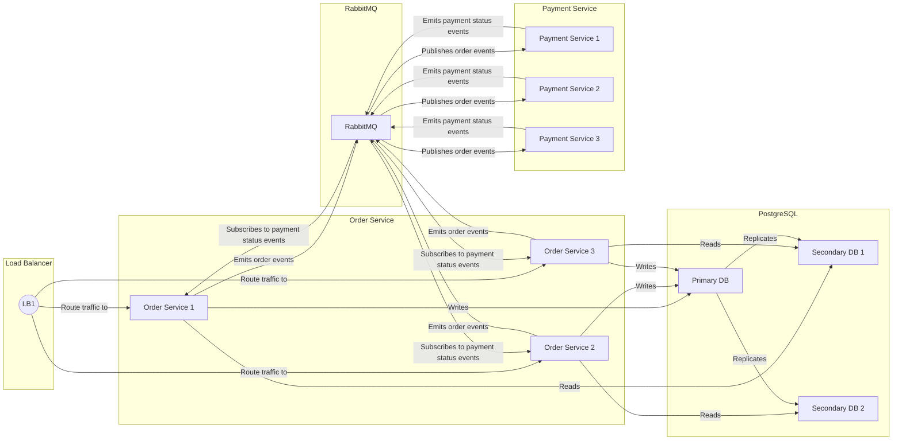

# Setup

## Running the services

### 1. cloning the Repository
Clone the repository to your local machine:

```bash
git clone https://github.com/sobystanly/tucows-interview
cd tucows-interview
```
### 2. Running Docker Compose
- Start PostgreSQL and RabbitMQ using Docker Compose

```bash
docker compose up -d
```
### 3.Building and Running the services
Order Management Service
- Navigate to the `order-management` directory.

```bash
cd order-management
```
Build and run order-management service using the Makefile:

```bash
make run
```
Payment Processing Service
- Navigate to the `payment-processing` directory.

```bash
cd ../payment-processing
```
Build and run the Payment Processing service using the Makefile:

```bash
make run
```

### Accessing Services
Once the services are running, you can access the APIs:
- order-management service: http://localhost:8001
- payment-processing service: http://localhost:8002

### Cleaning Up
To stop PostgreSQL and RabbitMQ and remove containers

```bash
docker compose down
```

### Additional Information
Makefile Commands
- `make build`: Build the binaries
- `make run`: Build and run the services
- `make clean`: Clean up binaries.
- `make test`: Run tests.

The documentation for each service can be found at respective readme.md of both services.

[order-management](order-management/README.md)
[payment-processing](payment-processing/README.md)

### Communication Flow Between Order and Payment Services

